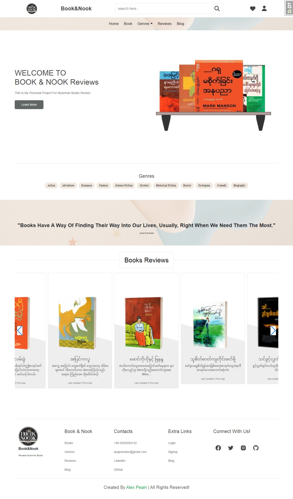

# Personal BOOK&NOOK Project

  Myanmar BookReviews MyanBookReviews

### Purpose of the project

- Learn By Building Focus on Backend Development
- For passion as an avid reader who does't have time and want to save time

#### Backend stacks and Configuration

- implement CRUD, API, Authetication & Authorization ,Web Security,
- Postgresql (DB scheme), logs, Performance (CICD)

#### Frontend Techology

- Javscript ,HTML,CSS

#### Business Logic

- Book Management (Add, Delete, edit)

  - Data Model handling Book Metadata
  - orgainze books into categories

- User Manangement

  - User registration /Authentication & Authorization
  - user -create account and manage (data ,editing /adding books)

- Reviews And Rating
  - enable user to write /rate books
- Searching and filetering

- Social Feature
- Recommendation (base on preference reaching histories)
- Notification

### Frontend Page View

## License

[MIT License](LICENSE)
